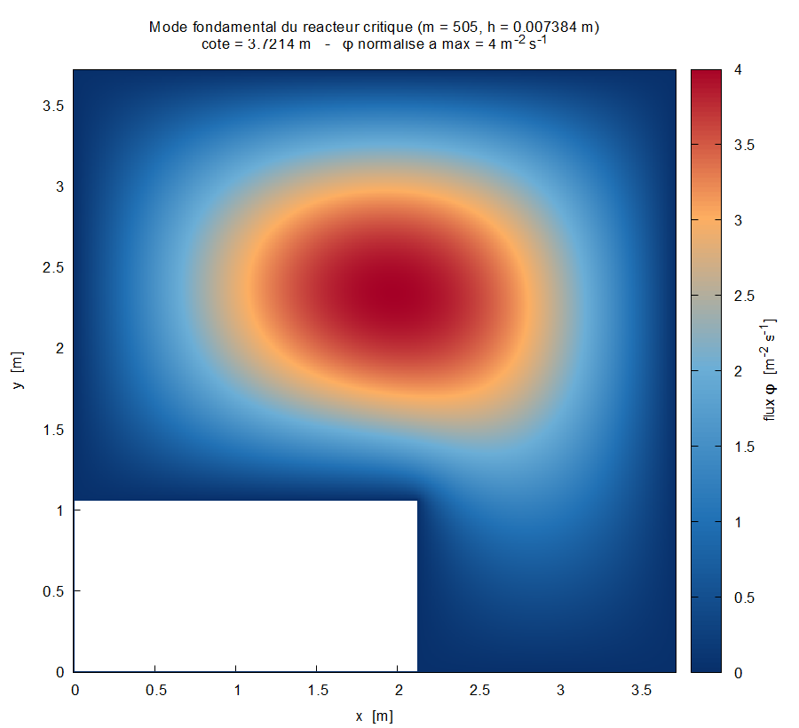
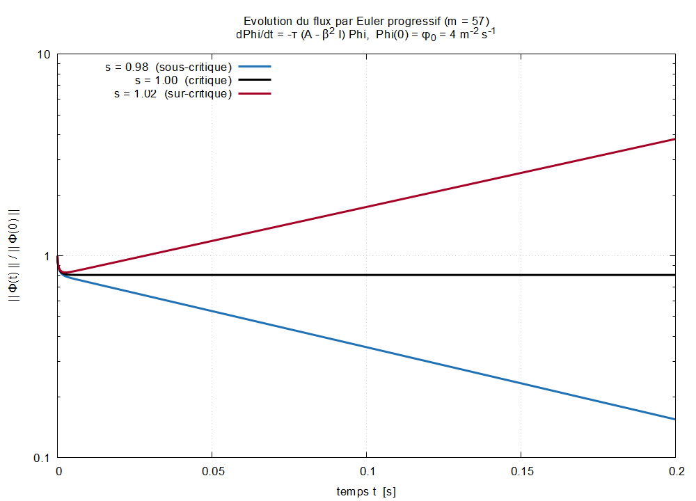

# Simulation numérique de la diffusion neutronique 2D

Résolution de l'équation de diffusion neutronique stationnaire dans le cœur
d'un réacteur nucléaire, par différences finies sur grille structurée.

Le problème se ramène à la recherche de la plus petite valeur propre d'un
grand système creux :

```
  -∂²φ/∂x² - ∂²φ/∂y² = β² φ    dans Ω
                   φ = 0        sur ∂Ω
```

discrétisé par le schéma centré à cinq points, ce qui donne le problème aux
valeurs propres `A Φ = β² Φ` où `A` est symétrique définie positive, creuse
(au plus 5 éléments non nuls par ligne) et stockée au format CSR.

Projet de *Compléments de calcul numérique* (MATH-H-301, ULB) — géométrie
n° 21.

---

## Le réacteur

Ω est un carré de 3,5 m de côté amputé de son coin sud-ouest — une forme en L :

```
  Ω = [0, 7/2] × [0, 7/2]  \  [0, 2] × [0, 1]
```

| Paramètre | Valeur | Unité |
|---|---|---|
| Buckling matériel β² | 2.0 | m⁻² |
| Constante cinétique τ | 100 | m² s⁻¹ |
| Flux initial φ₀ | 4.0 | m⁻² s⁻¹ |

Toute la géométrie et la physique tiennent dans la structure `REACTOR` de
[`geometry.c`](geometry.c) : changer de configuration ne demande de modifier
que ces sept nombres.

### Contrainte sur la grille

Les coins de l'encoche doivent tomber sur des nœuds de la grille, ce qui
impose que `h = L/(m-1)` divise exactement 2 m et 1 m, donc `m = 7k + 1` :

```
  m ∈ { 8, 15, 22, 29, 36, 43, 50, 57, ... }
```

Cette contrainte est **calculée** à l'exécution, pas codée en dur. Une valeur
de `m` incompatible est rejetée avec la liste des valeurs admissibles.

---

## Résultats principaux

### Dimensions critiques

Le réacteur fourni est **sous-critique** (λ_min = 2.261 > β² = 2) : il faut
l'agrandir d'un facteur α = √(λ_min/β²) ≈ 1.0633.

```
  Côté critique     : 3.7213 m
  Encoche critique  : [0, 2.1264] × [0, 1.0632] m
```

### Convergence dégradée par le coin rentrant

Le coin en (2, 1) est rentrant (angle intérieur 3π/2). La fonction propre y
est singulière, `φ ~ r^(2/3)`, et la convergence chute de l'ordre 2 attendu à
**l'ordre 4/3** :

| m | h [m] | n | λ_min [m⁻²] | L_crit [m] |
|---|---|---|---|---|
| 8 | 0.5 | 28 | 2.2401155668 | 3.7041474 |
| 15 | 0.25 | 137 | 2.2626376305 | 3.7227215 |
| 29 | 0.125 | 601 | 2.2639693479 | 3.7238169 |
| 57 | 0.0625 | 2 513 | 2.2626856690 | 3.7227610 |
| 113 | 0.03125 | 10 273 | 2.2617375490 | 3.7219810 |
| 225 | 0.015625 | 41 537 | 2.2612537023 | 3.7215829 |
| 449 | 0.0078125 | 167 041 | 2.2610350927 | 3.7214030 |
| 897 | 0.0039063 | 669 953 | 2.2609417329 | 3.7213261 |

Ordre observé : 0.437 → 0.970 → 1.146 → **1.227**, convergeant vers 4/3.
La convergence n'est pas monotone : L_crit croît jusqu'à m = 29 avant de
décroître. Le régime asymptotique n'est atteint qu'à partir de m ≈ 57.

L'ordre théorique est **déduit de la géométrie** (`count_reentrant_corners()`)
et non postulé : un coin du rectangle retiré strictement intérieur au carré
donne p = 4/3, sinon p = 2.

### Mode fondamental



Le flux se concentre dans la partie pleine du L. Sur ∂Ω il est nul
exactement — y compris le long de l'encoche — et le flux sur la première
couche intérieure passe de 37 % du maximum à m = 15 à 2,9 % à m = 505,
confirmant que la condition de Dirichlet est atteinte continûment.

### Évolution temporelle



Intégration de `dΦ/dt = -τ(A - β²I)Φ` par Euler progressif, pour des
réacteurs à 0,98 / 1,00 / 1,02 fois la dimension critique :

| s | régime | ω théorique [s⁻¹] | ω mesuré [s⁻¹] |
|---|---|---|---|
| 0.98 | sous-critique | −8.246564 | −8.246889 |
| 1.00 | critique | 0 | +0.000000 |
| 1.02 | sur-critique | +7.766244 | +7.765931 |

L'écart entre théorie et mesure vaut exactement `Δt·ω²/2`, l'erreur de
troncature d'ordre 1 d'Euler — vérifié à trois chiffres significatifs.

**La taille critique est un équilibre instable** : à ±2 %, le flux évolue en
e^(±8t), soit un temps de doublement de 0,089 s. La sensibilité vaut
dω/ds = 2τβ² = 400 s⁻¹, donc 1 % d'erreur sur la dimension produit 4 s⁻¹ de
taux de divergence.

### Stabilité d'Euler progressif

Le schéma est stable ssi `Δt < 2/(τ(λ_max - β²))`, soit `Δt = O(h²/τ)`. La
transition est vérifiée au millième près :

```
   dt/dt_max   |1-dt.τ(λmax-β²)|   ||Φ||/||Φ₀||   verdict
      0.999          0.998000        8.0427e-01    STABLE
      1.001          1.002000        3.0544e+12    DIVERGE
```

En production, `λ_max` est majoré par le rayon de Gershgorin : borne sûre,
0,11 % conservative, et gratuite.

### Comparaison de solveurs

PRIMME (fourni) contre ARPACK (`dsaupd`/`dseupd`, licence BSD), à précision
égale :

| m | n | matvecs PRIMME | matvecs ARPACK | temps PRIMME | temps ARPACK |
|---|---|---|---|---|---|
| 57 | 2 513 | 337 | 1 217 | 0.005 s | 0.048 s |
| 113 | 10 273 | 607 | 3 692 | 0.338 s | 0.669 s |
| 225 | 41 537 | 1 300 | 15 422 | 0.923 s | 28.2 s |

L'écart se creuse avec la taille du problème. Les valeurs propres concordent
à 10⁻¹³ près.

---

## Vérifications

Le projet ne se contente pas de produire des nombres, il les valide :

1. **Matrice CSR** — comparaison élément par élément avec les fichiers de
   référence `ia.21.txt` / `ja.21.txt` / `a.21.txt` fournis avec l'énoncé :
   identique sur les 116 éléments non nuls (`make check`).
2. **Valeur propre** — PRIMME et ARPACK concordent à 10⁻¹³ ; une
   diagonalisation dense indépendante confirme la valeur à 2·10⁻¹².
3. **Symétrie du spectre** — le graphe de la grille étant biparti,
   `λ_min + λ_max = 8/h²`. λ_min vient d'ARPACK, λ_max de PRIMME : deux
   solveurs distincts, écart **exactement nul**.
4. **Taux de croissance** — l'écart entre théorie et mesure coïncide avec
   l'erreur de troncature d'Euler à trois chiffres.
5. **Conditions aux limites** — flux nul sur ∂Ω par construction, et
   décroissance continue vérifiée sur la première couche intérieure.

---

## Compilation

Dépendances : un compilateur C, BLAS/LAPACK (OpenBLAS convient), ARPACK, et
gnuplot pour les figures. PRIMME est inclus dans [`primme/`](primme/).

```bash
cd primme && make lib && cd ..
make
```

Sous MSYS2/Windows :

```bash
pacman -S --needed mingw-w64-ucrt-x86_64-openblas \
                   mingw-w64-ucrt-x86_64-arpack \
                   mingw-w64-ucrt-x86_64-gnuplot make
```

Si BLAS et LAPACK sont fournis séparément, remplacer `LIBBLAS = -lopenblas`
par `-lblas -llapack` dans le [`Makefile`](Makefile).

## Utilisation

```
./main [options]

  -m M          nombre de points de grille par direction (défaut : 8)
  --check       comparer la matrice aux fichiers CSR de référence
  --no-solve    générer la matrice sans appeler le solveur
  --bench       comparer les deux implémentations du résidu
  --critical    étude de convergence de la dimension critique
  --levels K    nombre de grilles pour --critical (défaut : 6)
  --plot        tracer le mode fondamental (gnuplot)
  --plot-all    tracer pour m = 15 et m = 505
  --euler       intégration en temps autour de la taille critique
  --tfinal T    durée simulée pour --euler (défaut : 1 s)
  --stability   vérifier la limite de stabilité d'Euler
  --compare     comparer PRIMME et ARPACK
```

Les figures et données sont écrites dans `out/`.

## Organisation du code

| Fichier | Rôle |
|---|---|
| [`geometry.c`](geometry.c) | Domaine, grille, numérotation lexicographique des inconnues |
| [`prob.c`](prob.c) | Assemblage de la matrice au format CSR |
| [`residual.c`](residual.c) | Norme du résidu, implémentation fusionnée et témoin naïf |
| [`critical.c`](critical.c) | Homothétie, dimensions critiques, étude de convergence |
| [`plot.c`](plot.c) | Génération des données et scripts gnuplot |
| [`euler.c`](euler.c) | Euler progressif, taux de croissance, limite de stabilité |
| [`arpack.c`](arpack.c) | Solveur alternatif et comparaison avec PRIMME |
| [`interface_primme.c`](interface_primme.c) | Interface avec PRIMME |
| [`mytime.c`](mytime.c) | Mesure des temps CPU et horloge |
| [`main.c`](main.c) | Pilote en ligne de commande |

## Notes d'implémentation

**Résidu et pas d'Euler fusionnés.** `‖AΦ - β²Φ‖` et `‖Φ‖` sont accumulés en
une seule passe sur la matrice, sans tableau temporaire : le résidu de ligne
reste en registre, `x[i]` n'est chargé qu'une fois, et `ia[i+1]` est recyclé
en `ia[i]` de l'itération suivante. Mesuré 1,6 à 1,75 fois plus rapide que
l'implémentation littérale en trois passes.

**Le décalage spectral ne sert à rien pour Lanczos.** On pourrait croire que
remplacer A par `B = σI - A` accélère la convergence vers λ_min en la
transformant en recherche de λ_max. C'est faux : les sous-espaces de Krylov
sont invariants par décalage, `K(σI - A, v) = K(A, v)`. Les deux variantes
consomment le même nombre de produits matrice-vecteur, ce que
[`arpack.c`](arpack.c) vérifie expérimentalement. Seul le mode *shift-invert*
accélérerait réellement, au prix d'une factorisation creuse écartée ici.

**Redimensionner sans remailler.** Une homothétie de rapport α sur Ω divise A
par α². L'étude temporelle exploite cette propriété pour simuler des
réacteurs de tailles différentes en mettant simplement les coefficients à
l'échelle. Conséquence utile : à s = 1 le système discret est *exactement*
critique à la précision machine, donc le plateau observé n'est pas pollué par
l'erreur de discrétisation.

**Rendu du domaine à trou.** Les nœuds hors du réacteur sont écrits `NaN`,
sans déclarer `set datafile missing` — cette directive supprimerait
l'enregistrement et briserait la grille rectangulaire dont `with image` a
besoin. Le rendu `with image` centre un pixel sur chaque nœud ; `pm3d`
colorierait les mailles *entre* les nœuds et écarterait toute maille touchant
un NaN, faisant apparaître l'encoche une maille trop grande.

## Licence

Code du projet : usage académique.
[`primme/`](primme/) est distribué sous LGPL-2.1 (voir `primme/COPYING.txt`).
